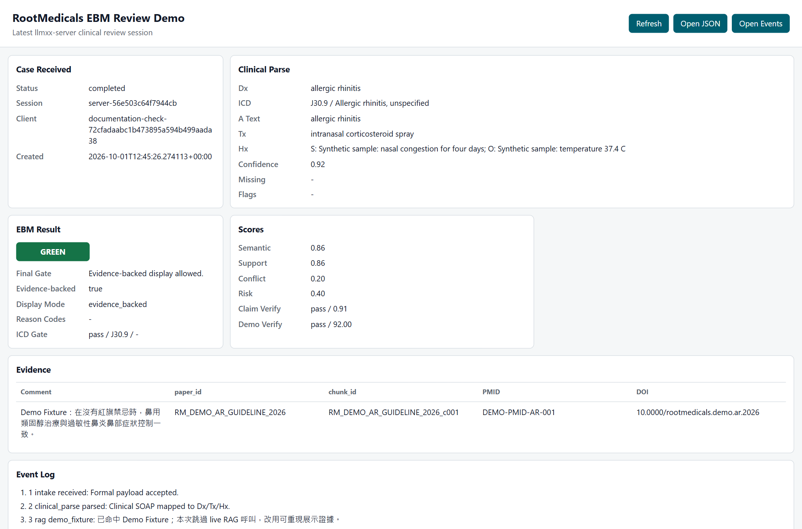

# RootMedicals — Clinical Evidence Demo

Capture a sample clinical screen and review the evidence summary.

This local prototype connects a mock clinical screen, screenshot intake and
an evidence-review viewer. It has distinct live, synthetic-fallback and fixed
fixture modes; they do not establish the same level of evidence.



*Real UI, synthetic case, fixed demo evidence. The displayed scores, green
indicator, citation identifiers and comments are fixture values. They are not
clinical validation or retrieved research results. Original UI labels are
shown unchanged.*

**Prototype / synthetic boundary:** this preview does not verify OCR,
live retrieval, clinical correctness, deployment readiness or patient use.

[Preview the fixture](#quick-start-synthetic-viewer) · [Use the control panel](#full-local-demo-control-panel) · [Read the procedure](doc/procedure.md)

## Quick Start: synthetic viewer

Use Python 3.10+ and a fresh checkout. This small preview replays structured
sample data; it does not capture a screen or run OCR. The full client and OCR
dependencies are listed in the module documents.

```powershell
git clone https://github.com/SpadesZ/rootmedicals-a.git
cd rootmedicals-a/llmxx-server
python -m venv .venv
.\.venv\Scripts\python -m pip install fastapi uvicorn cryptography
$env:LLMXX_DEMO_FIXTURE_MODE = "true"
$env:LLMXX_LAVA_TASK_BASE_URL = "http://127.0.0.1:9"
$env:LLMXX_RAG_CHECK_URL = "http://127.0.0.1:9"
.\.venv\Scripts\python -m uvicorn server_app.main:app --host 127.0.0.1 --port 8017
```

In a second PowerShell window, from the repository root:

```powershell
Invoke-RestMethod -Method Post -Uri http://127.0.0.1:8017/api/intake `
  -ContentType "application/json" -Body (Get-Content docs/assets/demo-payload.json -Raw)
```

Open http://127.0.0.1:8017/demo/latest. The response is explicitly marked
`demo_only_not_live_rag`. Port 9 keeps optional adapters disconnected for this
preview. Stop the server with Ctrl+C. Use the full control panel for capture
and configured RAG workflows.

## Modes and limits

| Mode | What the displayed evidence means |
|---|---|
| Demo Fixture | Fixed, synthetic evidence for a narrow example; no live retrieval |
| Live RAG + Synthetic | Allows a marked synthetic fallback; inspect its source before review |
| Live RAG | Uses configured retrieval/services; setup and evidence-backed acceptance are separate |

The existing HTTP smoke script assumes that clearing `soap.A` removes the
diagnosis. The sample above also supplies an ICD diagnosis, so that one legacy
assertion does not apply to this sample. To test a missing diagnosis, clear
both fields. This review verified fixture provenance and rejection of missing
diagnosis/unsupported schemas; it did not certify clinical outcomes.

## Technical Details

## Full local demo control panel

Use only the root control panel for demo operation:

```powershell
.\RootMedicals-Control.cmd
```

The control panel starts/stops the local `llmxx-server`, ClinicalGuard mock HIS,
LocalOCR tray client, and RAG/LAVA stack modes. Module-level PowerShell scripts
are kept as internal helpers for the control panel and engineering diagnostics.

## Main Runtime Folders

- `llmxx-client` - ClinicalGuard mock HIS, thin LocalOCR screenshot sender,
  doctor-side alert widget, and client runtime code.
- `llmxx-server` - intake API, server-side OCR/parse bridge, ICD/EBM gate, and
  demo viewer on port `8017`.
- `ebm-rag` - RAG/LAVA execution core, vector retrieval, evidence generation,
  and LAVA task bindings.
- `llmebm` - long-term EBM knowledge/taxonomy UI; local SQLite data is excluded from source control.
- `runtime_reports` - local verification summaries and handoff artifacts, created outside the tracked source.
- `legacy/launchers` - old double-click CMD wrappers kept only for traceability;
  new operation should use `RootMedicals-Control.cmd`.
