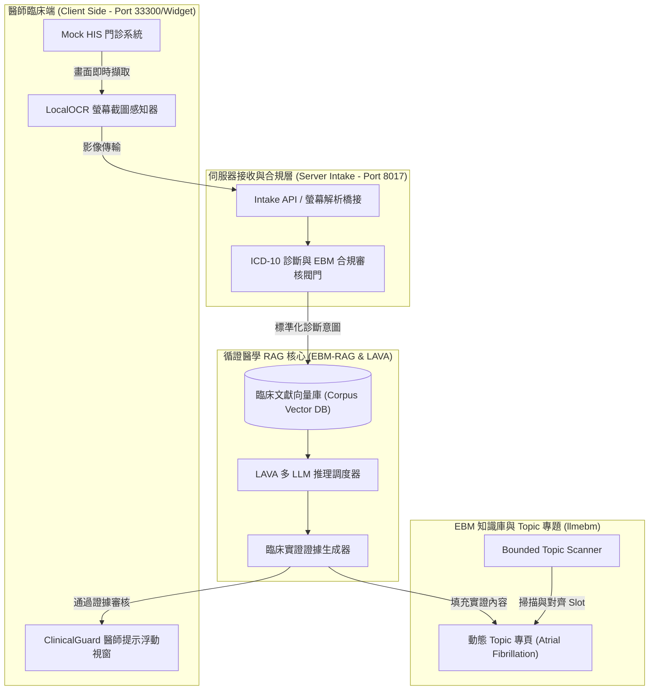

<div align="center">

# 🏥 RootMedicals
### **Clinical Client-to-RAG Evidence-Based Medicine (EBM) Closed-Loop Platform**

[](https://www.python.org/)
[](https://fastapi.tiangolo.com/)
[](https://react.dev/)
[](https://www.qt.io/)
[](https://pytorch.org/)
[](https://www.docker.com/)

*端到端臨床醫師輔助、LocalOCR 螢幕感知、循證醫學 RAG 檢索與動態主題知識庫系統*

[✨ 核心亮點](#-核心亮點-key-highlights) •
[🏛️ 系統架構](#-系統架構圖-architecture) •
[🧩 模組矩陣](#-模組架構-module-matrix) •
[📖 專題與驗證](#-動態-llmebm-專題與臨床驗證) •
[🚀 快速開始](#-快速開始指南-quick-start)

</div>

---

## 📖 專案簡介 (Project Overview)

**RootMedicals** 是一套專為臨床醫療場景打造的**端到端循證醫學 (Evidence-Based Medicine, EBM) 閉環系統**。系統結合醫師端 **ClinicalGuard Mock HIS**、**LocalOCR 螢幕智能感知**、**Server 端 ICD/EBM 臨床合規閥門**，以及 **EBM-RAG 向量檢索與 LAVA 多 LLM 引擎**，能在不破壞現有醫院 HIS 流程的前提下，即時為醫師提供符合最新臨床指南的實證醫學決策支援。

> 💡 **系統合規與安全**：不記錄敏感患者隱私資料 (PHI)，所有數據經過 ICD-10 診斷標準化與嚴格的臨床證據等級審核 (Clinical Evidence Gate)。

---

## ✨ 核心亮點 (Key Highlights)

| 功能模組 | 功能描述 | 核心技術與優勢 |
| :--- | :--- | :--- |
| 🩺 **ClinicalGuard 醫師端輔助** | 輕量化 LocalOCR 螢幕擷取與警示 Widget | PySide6 / Qt6 輕量化客戶端，零侵入擷取門診病歷畫面並發送即時警示 |
| 🛡️ **ICD/EBM 臨床合規閥門** | 診斷編碼標準化與證據品質驗證 | 整合 ICD-10-CM 國際標準代碼，通過 21-slot 交易控制防止虛假醫學幻覺 |
| 📚 **EBM-RAG 檢索生成引擎** | 臨床指南向量檢索與實證答案生成 | 結合 LAVA 多模型調度、臨床文獻分塊 (Chunking) 與語意對齊 |
| 🌐 **Dynamic LLMEBM Topic 知識庫** | 動態熱點專題與實證文獻展示 | 自建獨立網頁 (如心房顫動 Atrial Fibrillation)，動態填入最新檢索臨床證據 |
| 🎛️ **一鍵式整合控制台** | 完整整合測試與示範控制中心 | 提供 PowerShell / CMD 統一控制介面，快速切換 RAG/LAVA 多種運行模式 |

---

## 🏛️ 系統架構圖 (Architecture)



---

## 🧩 模組架構 (Module Matrix)

```
rootmedicals-a/
├── llmxx-client/                   # 🖥️ 臨床醫師端客戶端
│   ├── apps/thin-capture-client/  # LocalOCR 畫面擷取與 Alert Widget
│   └── mock-his/                   # ClinicalGuard 門診系統模擬介面
├── llmxx-server/                   # ⚙️ 伺服器接收與合規中樞 (Port 8017)
│   └── intake API, OCR 橋接, ICD/EBM Gate & Demo 檢視器
├── ebm-rag/                        # 🧠 EBM-RAG 向量檢索與 LAVA Task 執行核心
│   └── 向量檢索、證據生成、AF 指南資料集 (prepare_af_topic_corpus.py)
├── llmebm/                         # 📚 EBM 知識庫 UI 與主題專頁 (Port 33300)
│   └── 房顫動態專題頁面 (http://127.0.0.1:33300/topic/atrial-fibrillation)
├── RootMedicals-Control.cmd        # 🎛️ 根目錄一鍵啟動控制台
└── RootMedicals-Control.ps1        # 🛠️ PowerShell 控制腳本與診斷工具
```

---

## 📖 動態 LLMEBM 專題與臨床驗證

系統支援動態自載 Topic Page（例如心房顫動 Atrial Fibrillation 臨床專頁）：
- **專頁網址**：`http://127.0.0.1:33300/topic/atrial-fibrillation`
- **核心 API**：
  - Manifest 端點：`/api/v1/topic/{topic_name}/manifest`
  - 內容生成與狀態：`/content/{slot_id}`、`/content/generate`
  - RAG 準備度校驗：`/api/v1/rag/topic-content/readiness`
- **臨床驗證狀態**：目前已完成 21-slot 交易校驗與 112 個診斷指南切片 (Guideline Chunks) 的嚴格審計對齊。

---

## 🚀 快速開始指南 (Quick Start)

### 1. 複製倉庫 (Clone Repository)
```bash
git clone https://github.com/LAVA-Cowork/rootmedicals.git
cd rootmedicals
```

### 2. 使用控制台啟動 (Start via Control Panel)

在中控台環境中執行一鍵啟動指令：

```cmd
.\RootMedicals-Control.cmd
```

或使用 PowerShell 啟動完整服務棧：

```powershell
.\RootMedicals-Control.ps1 -Mode Full
```

控制台將自動啟動：
- `llmxx-server` (Port `8017`)
- `ClinicalGuard Mock HIS`
- `LocalOCR 輕量截圖客戶端`
- `LLMEBM 知識庫 UI` (Port `33300`)

---

## 🤝 貢獻與驗證 (Verification)

欲驗證心房顫動 (AF) 語料庫與 EBM 閥門狀態，可執行：

```powershell
python ebm-rag/tools/prepare_af_topic_corpus.py --verify-only
```

---

<div align="center">

Made with ❤️ by **LAVA-Cowork Team**

</div>
